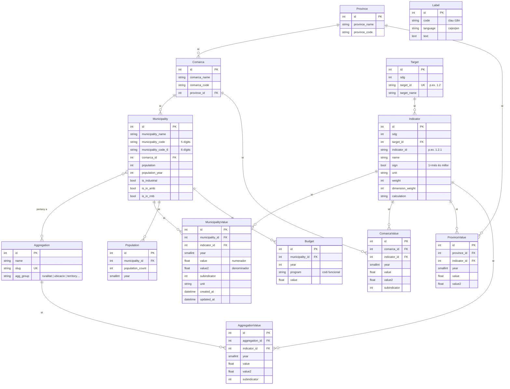

# Model de dades

El model de dades reflecteix tres conceptes principals: **l'estructura geogràfica** (municipis, comarques, províncies, agrupacions), **els indicadors ODS** (fites *targets* i indicadors) i **els valors** d'aquests indicadors per a cada entitat geogràfica i any.

## Diagrama de relacions



::: tip
Per a entitats obsoletes que es mantenen a l'esquema però ja no s'utilitzen (`Ruralitat`, `Ubicacio`, `TerritorialRegion`, `User`), vegeu les seccions corresponents més avall.
:::

## Entitats

### `Target` — Fites ODS *(targets)*

Representa una fita dels Objectius de Desenvolupament Sostenible (p. ex. fita "1.2").

| Camp | Tipus | Descripció |
|------|-------|------------|
| `id` | int | Clau primària |
| `sdg` | smallint | Número de l'ODS (1–17) |
| `target_id` | varchar(7) | Codi de la fita, p. ex. `"1.2"` |
| `target_name` | varchar(255) | Nom descriptiu de la fita |
| `indicators` | relació | Col·lecció d'`Indicator` associats |

---

### `Indicator` — Indicadors ODS

Cada indicador pertany a una fita (*target*) i defineix com es mesura i com es calcula el valor agregat.

| Camp | Tipus | Descripció |
|------|-------|------------|
| `id` | int | Clau primària |
| `sdg` | smallint | Número de l'ODS (redundant amb `target.sdg`, per rendiment) |
| `target` | FK → Target | Fita (*target*) a la qual pertany |
| `indicator_id` | varchar(7) | Codi de l'indicador, p. ex. `"1.2.1"` |
| `name` | varchar(255) | Nom descriptiu |
| `sign` | bool | `true` = més alt és millor; `false` = més baix és millor |
| `unit` | varchar(15) | Unitat de mesura interna (`%`, `hab.`, `€`, ...). Vegeu nota. |
| `scale` | smallint | Factor d'escala heretat. **No s'utilitza al backend** — l'escalat del valor mostrat el determina el frontend (vegeu nota) |
| `description` | varchar(255) | Descripció de l'indicador. Vegeu nota. |
| `source` | varchar(255) | Font de les dades (IDESCAT, INE, DIBA...) |
| `api_url_municipalities` | text | URL de l'API externa de la qual s'obtenen les dades |
| `weight` | int (0–100) | Pes de l'indicador per al càlcul de l'ODS sintètic |
| `dimension_weight` | int (0–100) | Pes de la dimensió per al càlcul sintètic |
| `calculation` | varchar(255) | Estratègia de càlcul (`simple`, `ratio`, ...) |

::: info Camps descriptius vs. etiquetes del frontend
Els camps `unit`, `name` i `description` de la taula `indicator` tenen un valor intern de referència, però **el text que mostra el frontend als usuaris no prové d'aquí**. El nom de l'indicador, la seva descripció i la unitat de mesura que apareix a la UI són etiquetes de llengua i s'editen als fitxers JSON del frontend (`src/locales/ca.json`, `es.json`, `en.json`). Vegeu [Textos i etiquetes](../frontend/textos).
:::

---

### `Municipality` — Municipis

Un registre per cada municipi inclòs al visor. A la instància de la Diputació de Barcelona, són 311 municipis de la província de Barcelona.

| Camp | Tipus | Descripció |
|------|-------|------------|
| `id` | int | Clau primària interna |
| `municipality_name` | varchar(255) | Nom del municipi |
| `municipality_code` | varchar(7) | Codi INE de 5 dígits (p. ex. `"08019"`) |
| `municipality_code_6` | varchar(7) | Codi INE de 6 dígits (p. ex. `"080193"`) |
| `comarca` | FK → Comarca | Comarca a la qual pertany |
| `population` | int | Última població disponible (dada de resum) |
| `population_year` | int | Any de la dada de `population` |
| `ubicacio` | FK → Ubicacio | Classificació per ubicació geogràfica |
| `ruralitat` | FK → Ruralitat | Classificació per ruralitat |
| `is_industrial` | bool | Municipi industrial |
| `is_in_amb` | bool | Pertany a l'Àrea Metropolitana de Barcelona |
| `is_in_rmb` | bool | Pertany a la Regió Metropolitana de Barcelona |
| `territorial_region` | FK → TerritorialRegion | Regió territorial ampliada |
| `aggregations` | M2M → Aggregation | Agrupacions a les quals pertany (taula pivot: `municipality_aggregation`) |

---

### `MunicipalityValue` — Valors per municipi

La taula principal de dades. Cada fila és el valor d'un indicador per a un municipi i un any concrets.

| Camp | Tipus | Descripció |
|------|-------|------------|
| `id` | int | Clau primària |
| `municipality` | FK → Municipality | Municipi |
| `indicator` | FK → Indicator | Indicador |
| `year` | smallint | Any de la dada |
| `value` | float | Valor principal |
| `value2` | float (nullable) | Valor secundari (p. ex. denominador d'un ràtio) |
| `subindicator` | int (nullable) | Subdivisió d'indicadors amb múltiples valors per any (p. ex. per sexe) |
| `month` | smallint (nullable) | Mes, si la granularitat és mensual |
| `unit` | varchar(15) | Unitat de mesura |
| `created_at` | datetime | Data de creació del registre |
| `updated_at` | datetime | Data de darrera actualització |

**Índexs:** `(year, indicator_id)` i `(year, subindicator)` per a consultes ràpides.

---

### `Comarca` — Comarques

| Camp | Tipus | Descripció |
|------|-------|------------|
| `id` | int | Clau primària |
| `comarca_name` | varchar(255) | Nom de la comarca |
| `comarca_code` | varchar(7) | Codi de comarca |
| `province` | FK → Province | Província |

---

### `ComarcaValue` — Valors per comarca

Mateixa estructura que `MunicipalityValue` però vinculada a una `Comarca`. Aquests valors es calcula amb la comanda `app:calculate-aggregation-values --target=comarca`.

---

### `Province` — Províncies

| Camp | Tipus | Descripció |
|------|-------|------------|
| `id` | int | Clau primària |
| `province_name` | varchar(255) | Nom de la província |
| `province_code` | varchar(5) | Codi de la província |

---

### `ProvinceValue` — Valors per província

Mateixa estructura que `MunicipalityValue` però vinculada a una `Province`.

---

### `Aggregation` — Agrupacions

Una agrupació és un conjunt de municipis que comparteixen una característica (ruralitat, ubicació, pertinença a la RMB, etc.). Els municipis pertanyen a una o més agrupacions via la taula pivot `municipality_aggregation`.

| Camp | Tipus | Descripció |
|------|-------|------------|
| `id` | int | Clau primària |
| `name` | varchar(255) | Nom de l'agrupació |
| `slug` | varchar(100) | Identificador URL-friendly, únic (p. ex. `"rural"`, `"litoral"`, `"amb"`) |
| `group` | varchar(50) | Grup al qual pertany (`"ruralitat"`, `"ubicacio"`, `"territory"`, ...) |

---

### `AggregationValue` — Valors pre-calculats per agrupació

Valors ja calculats per a cada agrupació, indicador i any. S'omple amb la comanda `app:calculate-aggregation-values`.

| Camp | Tipus | Descripció |
|------|-------|------------|
| `id` | int | Clau primària |
| `aggregation` | FK → Aggregation | Agrupació |
| `indicator` | FK → Indicator | Indicador |
| `year` | smallint | Any |
| `value` | float | Valor agregat calculat |
| `value2` | float (nullable) | Valor secundari |
| `subindicator` | int (nullable) | Subdivisió |
| `month` | smallint (nullable) | Mes |
| `unit` | varchar(15) | Unitat |

---

### `Population` — Sèrie temporal de població

| Camp | Tipus | Descripció |
|------|-------|------------|
| `id` | int | Clau primària |
| `municipality` | FK → Municipality | Municipi |
| `population_count` | int | Habitants |
| `year` | smallint | Any del padró |

Usada com a ponderació en algunes estratègies de càlcul d'agrupació.

---

### `Budget` — Pressupostos municipals

| Camp | Tipus | Descripció |
|------|-------|------------|
| `id` | int | Clau primària |
| `municipality` | FK → Municipality | Municipi |
| `year` | int | Any |
| `program` | varchar(6) | Codi de programa pressupostari |
| `value` | float | Import (€) |

---

### ~~`Ruralitat`~~, ~~`Ubicacio`~~ i ~~`TerritorialRegion`~~ — *Deprecated*

::: warning Obsoletes
Aquestes tres taules de lookup existeixen a l'esquema però **ja no s'utilitzen**. La seva funció ha estat absorbida per l'entitat `Aggregation`, que és el mecanisme únic per a totes les agrupacions de municipis. Els camps `ruralitat`, `ubicacio` i `territorial_region` de `Municipality` es mantenen per compatibilitat però no s'han de fer servir en codi nou.
:::

---

### `Label` — Etiquetes i textos de la UI

Emmagatzema els textos de la interfície d'usuari editables des del backoffice o via l'endpoint d'edició del frontend.

| Camp | Tipus | Descripció |
|------|-------|------------|
| `id` | int | Clau primària |
| `code` | varchar(255) | Clau d'i18n (p. ex. `"HOMEPAGE.TITLE"`) |
| `language` | varchar(10) | Codi d'idioma (`ca`, `es`, `en`) |
| `text` | text | Contingut del text |

Restricció única: `(code, language)`.

---

### ~~`User`~~ — *Deprecated*

::: warning Obsoleta
Aquesta entitat existeix a l'esquema però **no s'utilitza**. L'autenticació del projecte es gestiona via JWT sense persistir usuaris a la base de dades pròpia.
:::

## El model de valors: `value` i `value2`

Aquest és un dels conceptes més importants del model de dades. Les taules de valors (`municipality_value`, `comarca_value`, `province_value`, `aggregation_value`) **no emmagatzemen el número final que veu l'usuari**, sinó les dades en brut necessàries per calcular-lo. Cada fila té dos camps numèrics:

- `value` — el **numerador** (o l'únic valor, en indicadors simples)
- `value2` — el **denominador** (opcional)

Aquesta decisió és deliberada: emmagatzemant numerador i denominador per separat, el sistema pot **agregar correctament** els valors a nivell de comarca, província o agrupació (sumant numeradors i denominadors per separat abans de dividir), cosa que seria impossible si només guardéssim el percentatge ja calculat.

### Tres famílies d'indicadors

Segons com es combinen `value` i `value2`, els indicadors es divideixen en tres famílies:

| Família | Què s'emmagatzema | Com es mostra | Exemple |
|---------|-------------------|---------------|---------|
| **Ràtio** | `value` = numerador, `value2` = denominador | `value / value2 × factor` (×100, ×1000, ×10⁴, ×10⁵...) | `3.4.1` % població: `(value × 100) / value2` |
| **Simple** | només `value` | `value` tal qual (potser ×100 o ×1000) | `1.2.2` renda mediana: `value` |
| **Diferència** | `value` i `value2` | `value − value2` | `5.1.1` diferència d'atur dones−homes |

::: tip
El fet que un indicador sigui de tipus "ràtio" a nivell de càlcul es correspon amb l'estratègia `ratio` del càlcul d'agrupacions (vegeu [Agrupacions](./agrupacions)): el backend suma numeradors i denominadors per separat i desa `value`/`value2`, **sense aplicar cap factor d'escala**. El factor multiplicador (×100, ×1000...) l'aplica únicament el frontend en mostrar el valor (vegeu [Càlcul i format dels valors](./calcul-indicadors)). El camp `scale` de l'entitat `Indicator` és un romanent i no es fa servir al backend.
:::

### On es defineix el càlcul

La fórmula concreta de cada indicador (quina operació i quants decimals) es defineix **dues vegades**, i les dues han d'estar sincronitzades:

- **Backend** — `src/Util/IndicatorCalculator.php`
- **Frontend** — `src/utils/indicators.js`

Vegeu la pàgina dedicada [Càlcul i format dels valors](./calcul-indicadors) per a la taula completa de funcions de càlcul i el mapatge indicador → fórmula.

## Evolució de l'esquema: migracions

::: danger Cap canvi directe a la BBDD
Tots els canvis d'esquema (afegir/eliminar columnes, índexs, taules, etc.) **s'han de fer sempre via una migració Doctrine**. No editeu mai l'estructura de la base de dades amb un client SQL ni executeu `doctrine:schema:update` en producció. Les migracions són la **font de veritat versionada** de l'esquema, i sense elles els entorns acaben desincronitzats.
:::

### Flux habitual

```bash
# 1. Modificar l'entitat (afegir una propietat, canviar un tipus, etc.)
#    Pots fer-ho a mà a src/Entity/{Entity}.php o amb make:entity:
php bin/console make:entity Indicator

# 2. Generar la migració comparant l'estat actual de les entitats amb la BBDD
php bin/console make:migration
# (equivalent: php bin/console doctrine:migrations:diff)

# 3. Revisar el fitxer generat a migrations/Version{timestamp}.php
#    Cal llegir-lo sempre: a vegades cal afegir-hi una migració de dades manual.

# 4. Aplicar la migració
php bin/console doctrine:migrations:migrate
```

### Comandes habituals

| Comanda | Què fa |
|---------|--------|
| `make:entity` | Crea o modifica una entitat (afegeix propietats interactivament) |
| `make:migration` | Genera una migració a partir de la diferència entre entitats i BBDD |
| `doctrine:migrations:migrate` | Aplica totes les migracions pendents |
| `doctrine:migrations:status` | Mostra quines migracions s'han aplicat i quines queden |
| `doctrine:migrations:execute --down 'DoctrineMigrations\VersionXXX'` | Reverteix una migració concreta |
| `doctrine:migrations:rollup` | Marca totes les migracions com a aplicades (per a un esquema acabat de carregar) |
| `doctrine:schema:validate` | Comprova que entitats i BBDD coincideixen |
| `make:controller` | Crea un controlador buit |
| `make:command` | Crea una comanda CLI buida |

::: tip API Platform: cap canvi d'esquema
Afegir o modificar endpoints amb atributs `#[ApiResource]` o `#[ApiFilter]` **no requereix migració**: només afecta la capa HTTP. Només cal migració quan canvies columnes o relacions a l'entitat.
:::

### Documentació oficial

- [Doctrine ORM amb Symfony](https://symfony.com/doc/current/doctrine.html) — entitats, relacions, repositoris
- [Doctrine Migrations Bundle](https://symfony.com/bundles/DoctrineMigrationsBundle/current/index.html) — sintaxi i opcions completes
- [Maker Bundle](https://symfony.com/bundles/SymfonyMakerBundle/current/index.html) — `make:entity`, `make:migration`, etc.
- [API Platform](https://api-platform.com/docs/) — atributs `#[ApiResource]`, filtres, serialització

## Generar el diagrama complet

Si tens instal·lat el bundle `jawira/doctrine-diagram-bundle`:

```bash
php bin/console doctrine:generate:diagram
```
